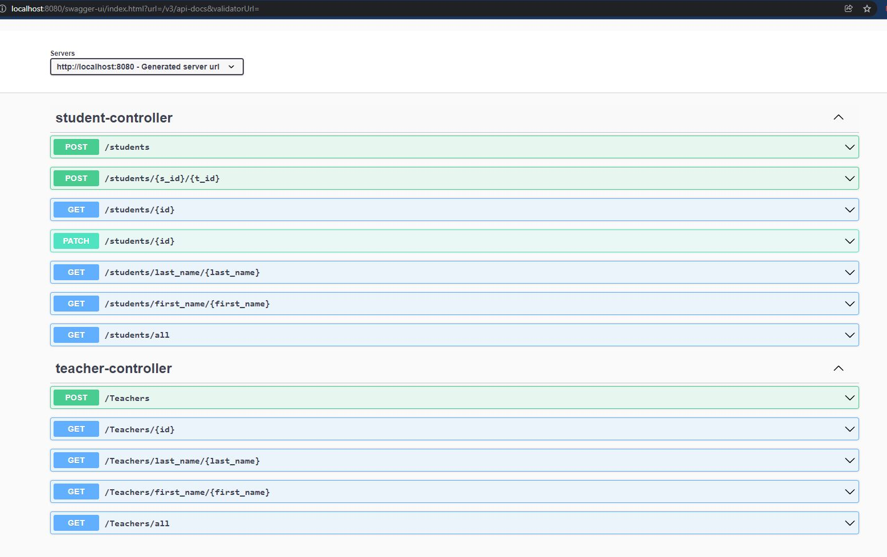

RESTAPI_DEMO

Swagger REST-API UI Link:

http://localhost:8080/swagger-ui/index.html?url=/v3/api-docs&validatorUrl=

1. [Source Code](src/java/restapi_demo)
2. Created some REST-APIs which can be verified througth the Swagger UI
3. Unfinished:
    - exception handling
    - logging
    - unit testing

